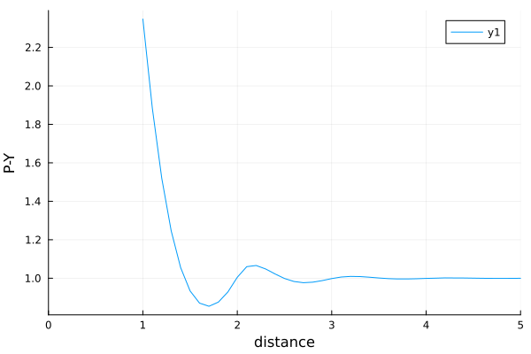

# ParticleCorrelations.jl

[](https://github.com/arturgower/ParticleCorrelations.jl/actions/workflows/CI.yml?query=branch%3Amain)


[](https://arturgower.github.io/ParticleCorrelations.jl/stable)
[](https://arturgower.github.io/ParticleCorrelations.jl/dev)

A package to calculate typical pair correlations (or structure factor) for disordered particulates, such as Percus-Yevick, and to calculate specific particle configurations from given pair correlation. 

Pair correlations are used in many fields in physical chemistry, statistical physics, condensed matter physics, material science, and many more. This package aims to be useful and easy to understand for many of these communities. 

## Pair correlation and Structure factor

The definition of the pair-correlation $g$, for a finite number of multi-species particles, is [1]

$$
g(\mathbf r_1, \lambda_1; \mathbf r_2, \lambda_2) = \frac{p(\mathbf r_1, \lambda_1; \mathbf r_2, \lambda_2)}{p(\mathbf r_1, \lambda_1)p(\mathbf r_2, \lambda_2)}\frac{J -1}{J}
$$  

where $\mathbf r_j$ is the vector position of the centre of particle - $j$, $\lambda_j$ represents the size or other distinguishing properties of the type of particle, $p$ is the probability density function, and $J$ is the total number of particles. Due to the definition of the pair-correlation, when the particles become uncorrelated in the limit $|\mathbf r_1 - \mathbf r_2| \to \infty$ we have that

$\lim_{|\mathbf r_1 - \mathbf r_2| \to \infty} g(\mathbf r_1, \lambda_1; \mathbf r_2, \lambda_2) = 1$.  

So far this package focuses on isotropic and statisticall homogeneous materials. Both these assumptions together imply that 

$$
g(\mathbf r_1, \lambda_1; \mathbf r_2, \lambda_2) = \frac{p(\mathbf r_1, \lambda_1; \mathbf r_2, \lambda_2)}{p(\mathbf r_1, \lambda_1)p(\mathbf r_2, \lambda_2)}\frac{J -1}{J}
$$  

where $|\mathbf r_1 - \mathbf r_2|$ is the distance between the particle centres.

Adding definitions and formulas for the structure factors...

## Particle configurations

formulas for discrete particles...

## Pair correlation from particles

We can calculate the pair-correlation from a configuration of particles. 

```julia
using ParticleCorrelations

# choose the spatial dimension
dim = 2

# choose the medium for the particles. Currently only one type
medium = HardMedium{dim}()

# choose the shapes of the particles
radius = 0.5
particle_shapes = [Sphere(dim,radius)]

# choose a region to place the particles within
dimensions = [80.0,60.0];
region_shape = Box([0.0,0.0],dimensions)

# create a uniform random arrangement of particles using Sequential Addition 
particles = random_particles(medium, particle_shapes;
    num_particles = 600, 
    volume_fraction = 0.15,
    region_shape = region_shape
)
```

If you have the Plots package installed you can plot these particles by using
```julia
using Plots

plot(region_shape)
plot!(particles)
plot!(axis = false, xlab = "", ylab = "")
```


```julia
rs = 0.0:0.4:8.0
pair = DiscretePairCorrelation(particles, rs)

# If you have the Plots package
plot(pair.r, 1 .+ pair.dp)
```


## Monte-Carlo methods

Here is a more convienient syntax to calculate pair-correlation from specific particle configurations.
```julia

dim = 2;

pairtype = MonteCarloPairCorrelation(dim; 
    rtol = 1e-3, 
    maxlength = 100, 
    iterations = 10, 
    numberofparticles = 3000
)

# choose the medium for the particles. Currently only one type
medium = HardMedium{dim}()

# choose the particle radius
radius = 0.5

# Choose the species, which represents a collection of one type of particle
s = Specie(
    medium,
    Sphere(dim, radius),
    volume_fraction = 0.15,
    separation_ratio = 1.0 # minimal distance from this particle = r * (separation_ratio - 1.0) 
);

pair = DiscretePairCorrelation(s, pairtype, rs)

# If you have the Plots package
plot(pair.r, 1 .+ pair.dp)
```


## Percus-Yevick

Let us consider a material filled with only one type of particle and use the Percus-Yevick approximation to calculate the pair-correlation for 3D hard spheres. That is, sphere which do not attract of repel each other. For details see [Notes on Percus-Yevick](docs/src//theory/P-Y.pdf) [2].
```julia
# choose the type of pair correlation
pairtype = PercusYevick(3; rtol = 1e-2, maxlength = 200)

# Percus-Yevick is currently implemented only for 3D. So we need to change the type of particle

s = Specie(
    HardMedium{3}(),
    Sphere(3, radius),
    volume_fraction = 0.3
);

# by ommiting the distances argument it will be calculated from the parameters provided by pairtype
pair = DiscretePairCorrelation(s, pairtype)
```

We can plot the result of the Percus-Yevick approximation with the package Plots:
```julia
using Plots

plot(pair.r, 1.0 .+ pair.dp,
    xlab = "distance", ylab = "P-Y"
)
```


which we can compare with Figure 8.3.1 from [1] below.


Note that for $x < 1$ the two particles of radius 0.5 would overlap, so the pair correlation should be zero. Also note that `dp` is the variation from uncorrelated, which is why we add 1.0 to get the pair correlation.

## Bespoke pair-correlation

Here is an example of choosing your own pair-correlation for a material filled with only one type of particle

```julia
using ParticleCorrelations

# particle radius 
r = 0.5

# mesh for the pair-correlation
rs = (2r):0.1:10.0

my_pair_correlation = 1.0 .+ 0.2 .* sin.(rs) ./ rs.^3


# spatial dimension. Needed for Monte Carlo or Structure factor
dim = 3

pair = DiscretePairCorrelation(dim, rs, my_pair_correlation)

```
Note that when specifying a pair-correlation, the minimal distance between particles will be taken to be `pair.r[1]`. This is stored in `pair.minimal_distance`.

## References

[1] Kong, Jin Au, Leung Tsang, Kung-Hau Ding, and Chi On Ao. Scattering of electromagnetic waves: numerical simulations. John Wiley & Sons, 2004.

[[2]](https://github.com/JuliaWaveScattering/EffectiveWaves.jl/blob/master/docs/src/theory/P-Y.pdf) Gerhard Kristensson. "The Percus-Yevick approximation". [github.com/JuliaWaveScattering/EffectiveWaves.jl](https://github.com/JuliaWaveScattering/EffectiveWaves.jl]) (2022).


